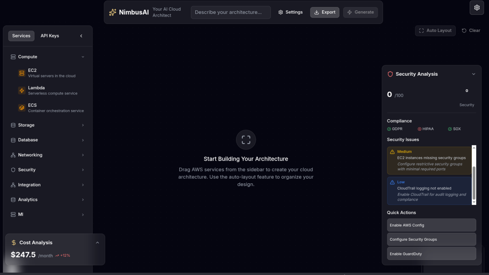
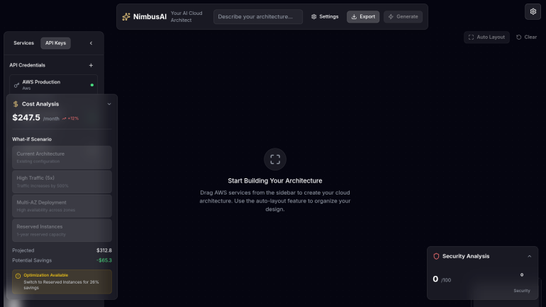

# NimbusAI - Your AI Cloud Architect

NimbusAI is a Kiro-powered AI Cloud Architect that turns natural language ideas into visualized, auditable, and deployable AWS infrastructure in seconds.


*The NimbusAI infinite canvas with real-time architecture visualization*

##  Demo Video
[Watch the NimbusAI Demo Recording](video/demo.webm)

## Edge
NimbusAI stands out with its **Design Engineering** approach and **Agentic Workflows**:
- **BYO-API Integration**: Bring your own AWS keys and external service credentials.
- **Infinite Design Canvas**: Powered by Next.js + React Flow.
- **What-if Architecture Simulator**: Forecast costs and reliability under hypothetical scenarios.
- **Security Auto-Remediation**: Generates fixes for architecture risks in real-time.




##  Quick Start

### Prerequisites
- **Node.js 18+** and npm
- **Kiro CLI** installed and authenticated
- **AWS credentials** (optional for BYO-API feature)

### Installation

1. **Clone and Install**
   ```bash
   git clone <repository-url>
   cd NimbusAI
   npm install
   ```

2. **Start Kiro CLI**
   ```bash
   # In project root
   kiro-cli
   
   # Load project context
   @prime
   ```

3. **Run Development Server**
   ```bash
   npm run dev
   ```

4. **Open Application**
   Navigate to `http://localhost:3000`

##  API Documentation

### Core Endpoints
- **POST `/api/architecture/generate`** - Generate architecture from natural language prompt
  ```json
  { "prompt": "Build a scalable video streaming platform", "constraints": {} }
  ```
- **POST `/api/validate-credentials`** - Validate BYO-API credentials
  ```json
  { "service": "aws", "credentials": { "accessKey": "...", "secretKey": "..." } }
  ```

### Agent Endpoints
- **Architecture Planner** - AWS Well-Architected designs with JSON schema output
- **Cost Analyst** - Real-time pricing with Reserved Instance recommendations
- **Security Auditor** - NIST/CIS compliance validation with auto-remediation

##  Troubleshooting

### Common Issues
- **Kiro CLI not found**: Ensure `kiro-cli` is installed and in PATH
  ```bash
  which kiro-cli  # Should return path
  ```
- **Architecture generation fails**: Check prompt format and verify Kiro CLI authentication
- **Canvas performance**: Large architectures auto-enable virtualization
- **BYO-API validation errors**: Verify credentials have required permissions

### Debug Commands
```bash
# Test Kiro CLI integration
npm run test:byo-api

# Check agent responses
kiro-cli chat "@01_architecture_planner"

# Validate Terraform output
terraform validate ./generated/
```

##  Usage Guide

### Basic Architecture Generation

1. **Enter Your Prompt**
   ```
   "Build a scalable video streaming platform with CDN and user authentication"
   ```

2. **Watch the Magic**
   - Architecture Planner generates AWS services
   - Diagram Generator creates visual layout
   - Cost Analyst calculates pricing
   - Security Auditor identifies risks

### Advanced Features

#### What-If Simulations
Test different scenarios on your architecture:

```bash
# High traffic scenario
"What if traffic increases by 500%?"

# High availability setup
"What if I need 99.99% uptime?"

# Cost optimization
"What if I use Reserved Instances?"
```

#### BYO-API Configuration
Integrate your existing services:

1. Click the **Settings** icon (top-right)
2. Add your credentials:
   - **AWS**: Access Key, Secret Key, Region
   - **Stripe**: Publishable & Secret Keys
   - **Twilio**: Account SID & Auth Token
   - **SendGrid**: API Key

##  Kiro Integration

### Custom Agents
NimbusAI leverages 7 specialized Kiro agents plus breakthrough innovation features:

1. **Architecture Planner** - AWS Well-Architected designs
2. **Diagram Generator** - Visual layout optimization
3. **Terraform Engineer** - Production-ready IaC with advanced validation
4. **Cost Analyst** - Real-time pricing analysis
5. **Security Auditor** - Compliance & vulnerability scanning
6. **Architecture Explainer** - Documentation generation
7. **UI Layout Designer** - Interface optimization

**Breakthrough Innovation Features:**
- **Adaptive Learning Engine** - Learns from user patterns and continuously improves recommendations
- **Quantum-Inspired Optimizer** - Multi-dimensional architecture optimization using quantum computing principles
- **Advanced Terraform Validation** - Comprehensive syntax, security, cost, and best practice validation

### Steering Documents
- **Architecture Rules**: Well-Architected Framework compliance
- **Infrastructure Rules**: Terraform standards and best practices
- **API Rules**: Security-first credential management
- **UI Design**: Glassmorphism aesthetic principles
- **Global Standards**: Code quality and testing requirements

##  Tech Stack

| Component | Technology | Purpose |
|-----------|------------|---------|
| **Frontend** | Next.js 14 + TypeScript | React framework with SSR |
| **Canvas** | React Flow | Interactive architecture diagrams |
| **Styling** | Tailwind CSS + Framer Motion | Glassmorphism UI with animations |
| **AI Orchestration** | Kiro CLI | Multi-agent workflows |
| **Infrastructure** | Terraform | Deterministic IaC generation |
| **Testing** | Jest + React Testing Library | Comprehensive test coverage |

##  Testing

Run the comprehensive test suite:

```bash
# Run all tests
npm test

# Run with coverage
npm run test:coverage

# Run integration tests
npm run test:integration

# Run in watch mode
npm run test:watch

# Full test suite (includes linting)
./test.sh
```

### Test Coverage
- **Unit Tests**: Component and utility function testing
- **Integration Tests**: API endpoints, workflow validation, and component interaction
- **100% Test Pass Rate**: All 16 test suites passing

##  Deployment

See [DEPLOYMENT.md](DEPLOYMENT.md) for comprehensive production deployment instructions including:
- Vercel, AWS Amplify, and self-hosted options
- Environment configuration and security setup
- Performance optimization and monitoring
- Scaling considerations and troubleshooting

##  Development History

See [DEVLOG.md](DEVLOG.md) for a detailed 7-day breakdown of the project's evolution.

##  License

MIT License - see [LICENSE](LICENSE) for details.

---

**Built with ❤️ using Kiro CLI for the AWS Hackathon 2026**
